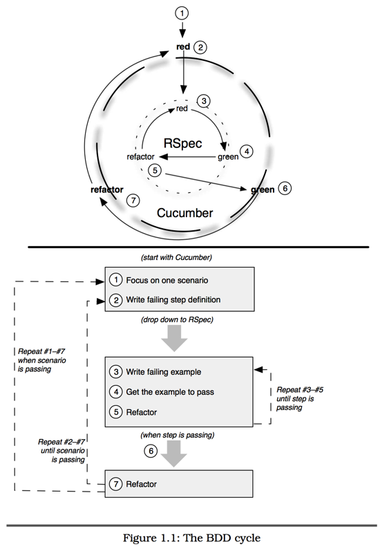


[目录](/the-rspec-book)

测试驱动（TDD）的开发模式流行以后，作为一种更好的理解和解释，行为驱动开发（BDD）逐步成熟。`Dan North`曾观察到，他管理的开发团队在实践TDD时，在处理一些平常的字符串测试时也遇到了很多困难。

`Dave Astels`在他那开创性的文章“A New Look at Test-Driven Development”中指出，即使有过很多经验的TDD实践者也可能在下一次实践中无法获得TDD的全部好处。

从这个角度看，也许非常必要简单探索一下什么是测试驱动开发（TDD）。

##Test-Driven Development: 从哪里开始？
`Test-Driven Development`是程序员在写被测试的代码之前，就把测试代码写好。 先写一个很小的测试，来测试还不存在的代码。运行测试，当然，结果肯定是测试失败的。现在，再写完整的代码使测试通过。就这么多了。

一单测试通过了，观察设计结果，并且对代码冗余的部分重构。在迭代的过程中修正设计，是非常自然而然的事情。

不要先添加代码，而是将修改先写到测试中。运行一下，看到失败，再修改代码使测试通过，重构代码。现在将新的迭代需求加入测试，观察到失败，再让她通过，重构，失败，通过，重构，失败，通过，重构。。。就这样周而复始。

在许多单元测试工具中，当测试失败我们会看到红色，而测试通过我们看到蓝色。所以，我们经常把这种循环标记`red/green/refactor`。

###应对需求变更
当代码增长到一定程度时，我们发现更关注的是“重构”这个步骤。需求设计一开始是无法完全确定的，因此随着系统开发的深入，设计会不断演变。这也是测试驱动开发最显著的副产品之一。

与其把TDD当作一种测试方法，我们更愿意把她看做是实现高质量代码的工具。

当然，这也是问题所在：TDD是`白盒测试`，必须先想清楚被测试目标的内部结构才可以写测试。

##Behaviour-Driven Development：下一步
`白盒测试`的问题在于我们需要测试对象是什么，而不是对象能做什么。
在应用层也是一样，利益相关方并不是很关心`数据以ANSI兼容的方式保存在关系数据库`中。他们真正关心的是`保存在数据库中`，甚至他们的真正意图只是希望`将数据持久保存在某个地方（不一定是数据库），然后能随时访问到`就够了。

###被测目标都是行为
BDD将焦点放在了行为上，而不是结构上，在所有开发层次上都如此。当我们讨论如何计算两个圆之间的距离，无论是通过第三方对象提供一个计算距离的服务，还是通过屏幕界面输入数据时验证数据的合法性，这都是行为！

一旦了解到这些，就可以改变我们思考驱动代码的方式。

###BDD中的词汇
我相信大多数开发团队会面临沟通问题。BDD的目标是通过简单的测试描述语言完成团队沟通，如：假如[一些条件]，当[某事件发生]，那么[我应该得到某个结果]。

`假如`、`当`、`那么`，BDD描述应用行为的词汇非常简洁。他们对商业分析人员、测试人员和开发人员来说都浅显易懂，在第17章你将看到`假如/当/那么`的详细例子。

##RSpec
RSpec是`Steven Baker`在2005年创建的。`Steven`从`Aslak Hellesøy`和`Dan North`的项目中得到了灵感。`Dave Astels`建议`Steven`试一试在Smalltalk和Ruby中使用TDD框架，因为这可以让我们更容易把精力集中在行为上，于是RSpec诞生了。

虽然`Steven`的RSpec原始版本中的细节已经改得面目全非，但基本理念仍然保留着。我们使用RSpec在语境中使用一小部分代码就可以描述可执行用例的行为。看起来就像这样：

    describe MovieList do
      context "当创建新对象时" do
        it "列表是空的" do
          movie_list = MoveList.new
          movie_list.should be_empty
        end
      end
    end

it()方法为MoveList创建了一个行为的例子，上下文中创建了一个MoveList对象。表达式movie_list.should be_empty是不言自明的。你可以大声读出来：）13.3节有be_empty()如何与movie_list交互的详细解释。

在rspec脚本中执行上面这段代码，会得到：

    MovieList 当创建新对象
      列表是空的

加入更多上下文和例子来执行，就像这样：

    MovieList 当创建新对象
      列表是空的
    MovieList 列表对象已包含一个节目
      列表不是空的
      已经包含一个节目

当然，我们刚才讨论的只是一个对象的实例，而不是一个系统。你当然可以使用RSpec指定一个应用的行为。但这种时候，其实我们更应该使用Cucumber。

##Cucumber
正如你即将在11章看到的，BDD是一套全桟式的敏捷开发方法，它使用了一些极限编程的技术，包括`验收测试驱动开发，即ATDP（Acceptance Test-Driven Planing）`。

在ATDP技术中，我们使用`验收测试`来驱动代码开发。理想情况下，这些测试是客户和交付团队共同编写的；但也可能是交付团队编写，然后由客户最终确定。这两种情况下，测试都是面向客户的，必须有一种语言能够对测试以面向客户的自然语言来描述。Cucumber就是这样一种语言。

Cucumber读取的纯文本文件，通过场景、步骤定义来描述应用的特性，并在自动执行检验开发成果。这里有一个例子：

    功能: 在线支付账单
      为了节省我支付账单的时间，
      作为有一个帐户的银行客户
      我想在线支付账单
      
    场景: 支付账单
      假如帐户有50美元
      并且有一个叫Acme的收款人
      并且有一个支付给Acme的37美元的账单
      当我为Acme支付账单
      那么我的帐户中应当剩余13美元
      并且支付给Acme的37美元付款应当出现在最近付款的列表中
      
以上的例子就是包含场景的Cucumber文档。

第四章还会介绍使用Ruby写的Cucumber步骤定义。这些不走定义通过可读的Cucumber场景与开发代码交互。

到现在为止还没有感觉的话，也不比担心。现在只需要明白无论是RSpec还是Cucumber都是为了帮助我们指定`行为`的实例代码，细节很快会清晰。

我们使用Cucumber描述了应用的行为，并使用RSpec描述对象的行为。如果你以前实践过TDD，那么你可能熟悉`red/green/refactor循环`。像Cucumber这种高层次的工具也包含类似的功能。

##BDD循环
在每个RSpec循环中的绿色点，我们都要检查Cucumber循环。如果它依然是红色，那么在告诉我们需要进入下一个RSpec循环。如果它已经是绿色，那么我们可以跳出Cucumber循环，开始新的迭代了，并且从一个失败的Cucumber步骤开始新的循环。

在下一章里，我们将通过实际例子学习Cucumber和RSpec。第三章开始我们使用Cucumber和RSpec描述一组需求功能。目的是学习特定的技术细节，所以在大部分情况下我们会点到为止。

