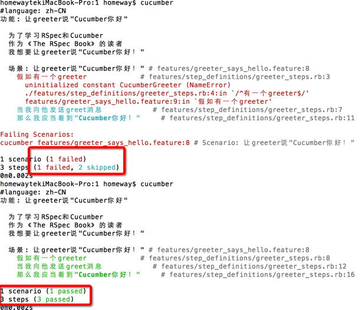


[目录](/the-rspec-book)

作为传统，所有介绍编程语言的书都会从“Hellow World”的例子开始。虽然RSpec不是一个完整的编程语言，但它起码是一套可以描述对象行为的领域特定语言（DSL）。同样，Cucumber是描述应用行为的DSL。

为了符合传统，我们要为一个RSpec和Cucumber写一下"Hello World"例子。但还得先搞清楚安装环境。

##安装
安装rspec（有些系统环境需要加`sudo`前缀）：

    $ gem install rspec

现在输入 `rspec --help`，应该看到类似下面的输出：

    $ rspec --help
    Usage: rspec [options] [files or directories]
    ...

安装cucumber：

    $ gem install cucumber
    
##Hello RSpec
建立一个文件`greeter_spec.rb`，并输入如下内容：

    #encoding: utf-8
    describe "RSpec开始了!" do
      it "当接收到greet()消息时，应该显示'RSpec 开始了!'" do
        greeter = RSpecGreeter.new
        greeting = greeter.greet
        greeting.should == 'RSpec 开始了!'
      end
    end

执行RSpec命令，结果如下：

    $ rspec greeter_spec.rb 
    F

    Failures:

      1) RSpec开始了! 当接收到greet()消息时，应该显示'RSpec 开始了!'
         Failure/Error: greeter = RSpecGreeter.new
         NameError:
           uninitialized constant RSpecGreeter
         # ./greeter_spec.rb:4:in `block (2 levels) in <top (required)>'

    Finished in 0.00064 seconds
    1 example, 1 failure

    Failed examples:

    rspec ./greeter_spec.rb:3 # RSpec开始了! 当接收到greet()消息时，应该显示'RSpec 开始了!'

修改一下源码：

    #encoding: utf-8

    class RSpecGreeter
      def greet
        "RSpec开始了!"
      end
    end

    describe "RSpec开始了!" do
      it "当接收到greet()消息时，应该显示'RSpec开始了!'" do
        greeter = RSpecGreeter.new
        greeting = greeter.greet
        greeting.should == 'RSpec开始了!'
      end
    end

重新验证：

    $ rspec greeter_spec.rb 
    .

    Finished in 0.00031 seconds
    1 example, 0 failures

##Hello Cucumber
对于Cucumber我们需要稍微复杂一点的文件结构，让我们建立一个名为`hello`的小项目。在`hello`目录中，添加`features`和`spec`两个目录，然后将`greeter_spec.rb`移到`hello/spec`目录。

在`features`目录中新建 `greeter_says_hello.feature`文件：

    #language: zh-CN
    功能: 让greeter说"Cucumber你好"

      为了学习RSpec和Cucumber
      作为《The RSpec Book》的读者
      我想要让greeter说"Cucumber你好！"
      
      场景: 让greeter说"Cucumber你好！"
        假如有一个greeter
        当我向他发送greet消息
        那么我应当看到"Cucumber你好！"
      
      

运行cucumber：

    $ cucumber
    #language: zh-CN
    功能: 让greeter说"Cucumber你好"
      
      为了学习RSpec和Cucumber
      作为《The RSpec Book》的读者
      我想要让greeter说"Cucumber你好！"

      场景: 让greeter说"Cucumber你好！" # features/greeter_says_hello.feature:8
        假如有一个greeter             # features/greeter_says_hello.feature:9
        当我向他发送greet消息            # features/greeter_says_hello.feature:10
        那么我应当看到"Cucumber你好！"     # features/greeter_says_hello.feature:11

    1 scenario (1 undefined)
    3 steps (3 undefined)
    0m0.002s

    You can implement step definitions for undefined steps with these snippets:

    假如(/^有一个greeter$/) do
      pending # express the regexp above with the code you wish you had
    end

    当(/^我向他发送greet消息$/) do
      pending # express the regexp above with the code you wish you had
    end

    那么(/^我应当看到"(.*?)"$/) do |arg1|
      pending # express the regexp above with the code you wish you had
    end

    If you want snippets in a different programming language,
    just make sure a file with the appropriate file extension
    exists where cucumber looks for step definitions.

我们现在从输出内容上看到一个摘要，提醒我们需要实现步骤定义。

按照输出上的提示，直接拷贝步骤定义就可以了。每个步骤定义中都包含一个正则表达式和一个block代码块。Cucumber从场景中的第一个步骤开始阅读，`假如有一个greeter`，然后从步骤定义中通过正则表达式寻找匹配的代码块，并执行；接着寻找下一个。

为了让场景通过，我们需要将步骤定义保存在一个Cucumber能加载的文件中。这需要在`hello/features`目录中增加一个新的目录`step_definitions`，并在新目录中建立文件`greeter_steps.rb`：

    #encoding: utf-8

    假如(/^有一个greeter$/) do
      @greeter = CucumberGreeter.new
    end

    当(/^我向他发送greet消息$/) do
      @message = @greeter.greet
    end

    那么(/^我应当看到"(.*?)"$/) do |greeting|
      @message.should == greeting
    end

重新执行，应该看到如下结果：

    $ cucumber
    #language: zh-CN
    功能: 让greeter说"Cucumber你好"
      
      为了学习RSpec和Cucumber
      作为《The RSpec Book》的读者
      我想要让greeter说"Cucumber你好！"

      场景: 让greeter说"Cucumber你好！" # features/greeter_says_hello.feature:8
        假如有一个greeter             # features/step_definitions/greeter_steps.rb:3
          uninitialized constant CucumberGreeter (NameError)
          ./features/step_definitions/greeter_steps.rb:4:in `/^有一个greeter$/'
          features/greeter_says_hello.feature:9:in `假如有一个greeter'
        当我向他发送greet消息            # features/step_definitions/greeter_steps.rb:7
        那么我应当看到"Cucumber你好！"     # features/step_definitions/greeter_steps.rb:11

    Failing Scenarios:
    cucumber features/greeter_says_hello.feature:8 # Scenario: 让greeter说"Cucumber你好！"

    1 scenario (1 failed)
    3 steps (1 failed, 2 skipped)
    0m0.002s

`uninitialized constant CucumberGreeter (NameError)`意思是类没有定义。那么我们增加类定义的代码：

    class CucumberGreeter
      def greet
        'Cucumber你好！'
      end
    end

重新执行cucumber：

    $ cucumber
    #language: zh-CN
    功能: 让greeter说"Cucumber你好"
      
      为了学习RSpec和Cucumber
      作为《The RSpec Book》的读者
      我想要让greeter说"Cucumber你好！"

      场景: 让greeter说"Cucumber你好！" # features/greeter_says_hello.feature:8
        假如有一个greeter             # features/step_definitions/greeter_steps.rb:8
        当我向他发送greet消息            # features/step_definitions/greeter_steps.rb:12
        那么我应当看到"Cucumber你好！"     # features/step_definitions/greeter_steps.rb:16

    1 scenario (1 passed)
    3 steps (3 passed)
    0m0.002s
此时，所有步骤定义都通过了。现在我们通过了一个RSpec实例和一个Cucumber场景。你可以输入`rspec spec`来运行所有在目录`spec`中的实例，看到的输出与上一节应该是一样的。

###cucumber命令行输出的着色
