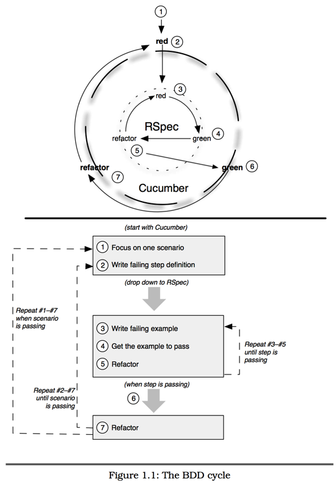



本文拟通过一些简单的例子讲解，了解什么是Cucumber和RSpec。实际上，如果没有足够多的项目管理经验，是无法感受到BDD魅力的，反而会觉得RSpec已经足够，Cucumber纯属画蛇添足。

##BDD开发步骤
《The RSpec Book》（英文版）28页，有一个经典的BDD周期说明图示，足以说明为什么RSpec还不够，还要外加一层Cucumber来做测试。

简单来说，本文要使用的BDD开发的具体步骤就是：

1. 根据需求，编写用户故事
2. 根据用户故事，逐项编写Cucumber文件，黑箱方式测试用户体验（典型的例子，如命令行、网页输入等）
3. 根据Cucumber要求，逐项编写RSpec文件，白箱方式测试类的实现（典型的例子，如Rails中的Controller、Modal等）
4. 根据RSpec要求，逐项使用Ruby和Rails技巧编写实现代码
5. 确定代码已经按RSpec行为预期实现
6. 确定代码已经按Cucumber的行为预期实现
7. 全部Cucumber测试通过，表示需求全部完成，有新需求又从步骤1开始

##Cucumber和RSpec版本
    $ gem list rspec

    *** LOCAL GEMS ***

    rspec (2.14.1)
    rspec-core (2.14.4)
    rspec-expectations (2.14.1, 2.14.0)
    rspec-mocks (2.14.3, 2.14.2)
    rspec-rails (2.14.0)
    
    $ gem list cucumber

    *** LOCAL GEMS ***

    cucumber (1.3.6, 1.3.5)
    cucumber-rails (1.3.1)

##Cucumber初体验
Cucumber已经有了第一本专业的中文书《Cucumber：行为驱动开发指南》。下面的例子是从这本书中演化而来的。

建立一个feature目录，然后编辑文件`feature/adding.feature`

    # language: zh-CN
    功能: 加法计算
      这是一个模拟计算器的工具，目的是演示基本的Cucumber应用。
      
      在这一类Cucumber文档中，你不仅可以用中文书写，而且可以做非常详尽的描述，比如我现在这样。
      你可以写一个简单的命令行程序calc.rb，然后只接收一个字符串参数，如"2+2"。
      
      从用户角度测试时，我们是把命令行程序与参数字符串连接起来调用的，即"calc.rb 2+2"，而我们会对屏幕输出的结果进行校验，案例在场景大纲的例子中给出。
      
      场景大纲: 两数相加
        假如输入一个 "<input>"
        当计算器运行时
        那么输出应该是 "<output>"
        
        例子:
          | input | output |
          | 2+2   | 4      |
          | 98+1  | 99     |

为了满足这个功能要求，我们要建立一个文件，这种做法叫`留桩`：

    $ touch calc.rb
再建立一个feature/step_definitions目录，然后编辑文件`features/step_definitions/calculator_steps.rb`

    # encoding: UTF-8
    
    假如(/^输入一个 "(.*?)"$/) do |input|
      @input = input
    end
    
    当(/^计算器运行时$/) do
      @output = `ruby calc.rb #{@input}`
    end
    
    那么(/^输出应该是 "(.*?)"$/) do |output|
      @output.should == output
    end

再执行命令`cucumber`可得到一个Cucumber的测试结果，告诉我们执行失败的原因（因为我们还没有真正实现，这个 `calc.rb`目前是个空文件，当然不会成功）。

只要在`calc.rb`中添加一行代码就可以完成这个模拟计算器的功能了：

    print eval(ARGV[0])

每一次功能添加都是一次新的迭代。你可以试着添加其他的计算器功能，想好之后先把功能说明、场景和例子写到feature文件，然后运行cucumber，根据提示增加步骤定义，定义完成后再开始编写实现代码。

这个过程就是基本的BDD模式开发，由功能需求驱动代码编写。

这种feature文件被称为活文档，他们永远都是最新的（永远不会落后于代码的实现程度），这就是Cucumber的真正价值。

##RSpec印象
有兴趣的读者可以从这篇PPT[RSpec让你爱上写测试](http://www.slideshare.net/ihower/rspec-7394497)来学习RSpec。实际上，下面的内容就是从这篇文章中一小节内容中演化而来的。

RSpec实际上是仍然是xUnit测试方法，但包装了一层可读性更好的语法糖。

每个xUnit都是从依次执行所有Test Case，并在每个Case中按照下面的顺序完成一次测试：
1. Setup 初始化测试场景
2. Exercise 执行被测试程序
3. Verify 验证效果是否如预期
4. Teardown 清理测试现场

下面先看一个Ruby的Test::Unit案例：

    class OrderTest < Test::Unit::TestCase
      def setup
        @order = Order.new
      end
      def test_order_status_when_initialized
        assert_equal @order.status, "New"
      end
      def test_order_amount_when_initialized
        assert_equal @order.amount, 0
      end
    end

下面是对应的RSpec写法：

    describe Order do
      before do
        @order = Order.new
      end
      context "when initialized" do
        it "should have default status is New" do
          @order.status.should == "New"
        end
        it "should have default amount is 0" do
          @order.amount.should == 0
        end
      end 
    end

RSpec将类名换成了`describe`关键字，再通过`context`、`it`关键字构建测试过程，更加近人类的语言（而不是机器的语言）。相比之下，xUnit由测试函数构成，命名是个重复工作，不符合DRY原则。

下面建立一个spec目录，然后编辑文件`spec/order_spec.rb`，输入下面的内容。

    class Order
      attr_accessor :status, :amount
      def initialize
        @status = 'New'
        @amount = 0
      end
    end
    
    describe Order do
      before do
        @order = Order.new
      end
      context "when initialized" do
        it "should have default status is New" do
          @order.status.should == "New"
        end
        it "should have default amount is 0" do
          @order.amount.should == 0
        end
      end 
    end    

再执行命令`rspec order_spec.rb`可得到一个RSpec的测试结果。

##在Cucumber中使用RSpec语法
我们可以使用RSpec语法做断言，最常用的就是should和should_not

