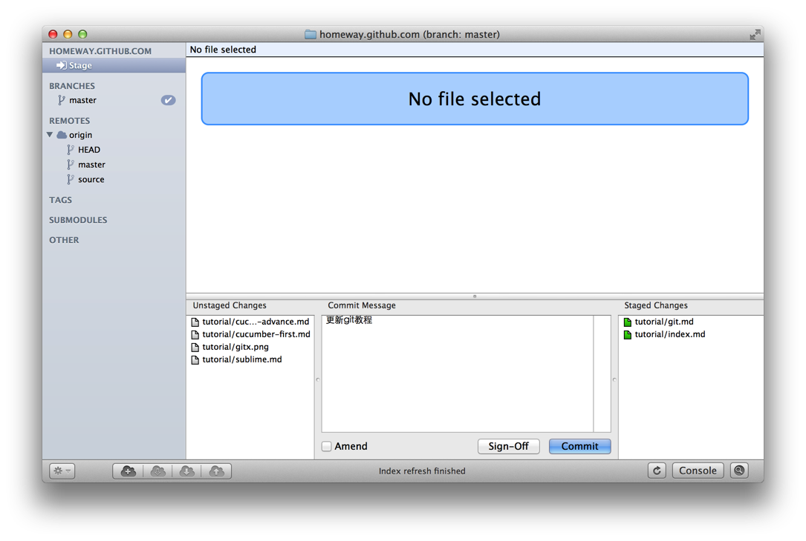
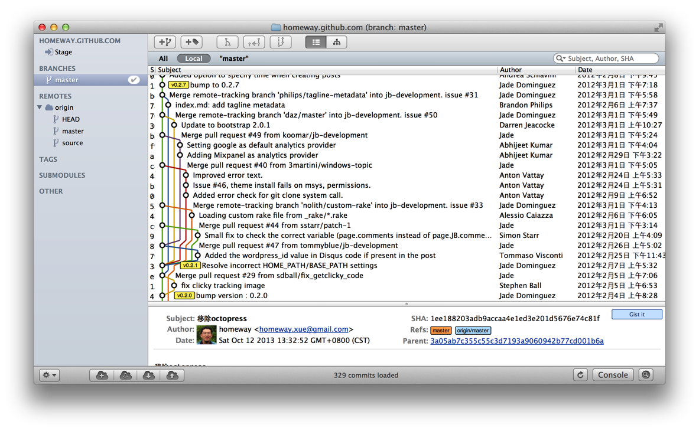
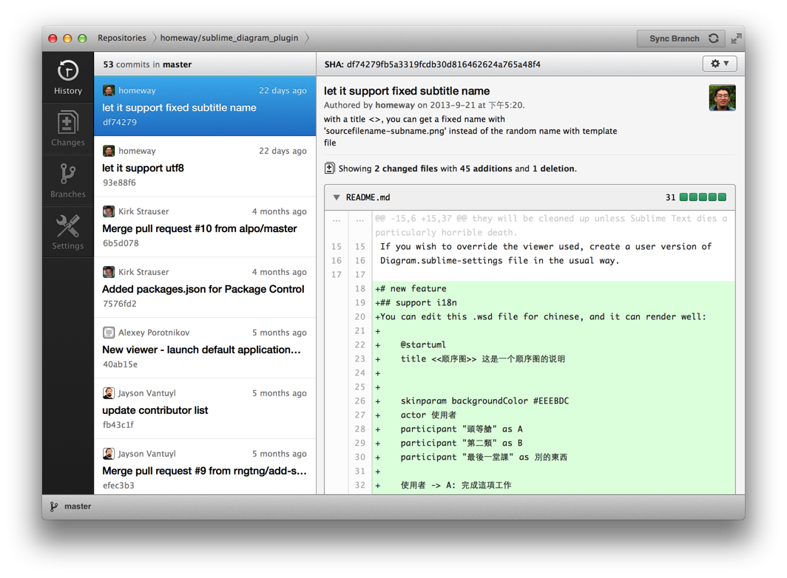



##Git安装
当Rails流行的时候，Git已经是开源社区中最主要的版本管理系统了。

Git与其他开源社区的工具一样，天然地生长在unix类操作系统上（linux、macos、bsd、unix等），这主要是指在windows下使用git是需要一些额外工作的。但这方面的文章很多，本文不打算探讨。

##创建版本库和第一次提交
    $ git version
    $ sudo git config --global user.name 'homeway'
    $ sudo git config --global user.email 'homeway.xue@gmail.com'

    $ mkdir project1
    $ cd project1
    $ git init
    $ ls -laF
    drwxr-xr-x   4 homeway  staff  136 10 12 12:42 ./
    drwxr-xr-x  19 homeway  staff  646 10 12 12:42 ../
    drwxr-xr-x  13 homeway  staff  442 10 12 13:18 .git/
上面这个隐藏的.git就是版本库（又叫做repository），`与SVN不同，git只在这一个目录中跟踪文件`。

    $ echo 'hello' >> hello.txt
    $ git add hello.txt
    $ git commit -m 'hello init'
    $ git status

##几个有用的命令
    $ git status

    $ git rev-parse --git-dir
    $ git rev-parse --mater

    $ git config -e           #项目内设置
    $ git config -e --global  #用户设置
    $ git config -e --system  #系统设置
    $ git config --global user.name
    $ sudo git config --global user.name 'homeway'
    $ sudo git config unset --global user.name
  
    $ git log
    $ git reflog

##理解暂存区
暂存区，即stage，位于`.git/index`目录，是git最成功的设计。`git commit -a`命令可以越过缓存区，但是不推荐使用。

多了一个缓存，避免了不必要的提交错误，更加方便commit反悔撤销（反悔可以不影响工作目录），而且提高了提交质量。

>这里透露了一个`频繁提交`的思想，既期待使用者频繁提交，又希望每次都是慎重的提交。思路清晰的部分写好提交说明，提交到版本库；还不清晰的部分就让她留在缓存区，一样可以作版本库管理。

##Git对象
    $ git log --pretty=raw
    commit e90038a5ba1a2af7e1a2c83925af83f2af545c1c
    tree 72590777945568c612303a82a3cd71e83a8f947e
    parent 4b984ffacff01515b7b1314ba33e4449e0a1db7a
    author homeway <homeway.xue@gmail.com> 1381711814 +0800
    committer homeway <homeway.xue@gmail.com> 1381711814 +0800
    
    hello

Git里的对象使用40位SHA1哈希值表示。git对象可以仅使用开头的几位，不冲突即可。

使用`git cat-file`命令研究对象

    $ git cat-file -t e90038a #查看类型
    $ git cat-file -p e90038a #查看内容

    $ git reflog
    c24095b HEAD@{0}: checkout: moving from master to master
    c24095b HEAD@{1}: checkout: moving from c24095b217b13a0c432c8f60f75db3d52bb65efe to master
    c24095b HEAD@{2}: checkout: moving from master to c24095b217b13a0c432c8f60f75db3d52bb65efe
    c24095b HEAD@{3}: commit (initial): hello init

记住分支的SHA1哈希表示很关键。例如，当你在“分离头指针”的模式下提交时，会不幸地发现找不到刚刚地提交了.不要害怕，使用`git reflog`查看一下所提交的分支，还可以挽救这个提交的。

1. 首先，切换回某个分支，如master；
2. 然后，执行`git merge #####`命令，合并刚才的提交。

##对当前提交反悔
使用图形工具中的`Amend`重新提交即可。

##回到多次提交以前
`注意，这是个比较危险的操作！`
 因此，图形工具一般不提供；但有时候被粗心的提交郁闷了，还是很管用。

通过命令以下命令都可以回到最近两次提交之前的状态： 

    $ git reset HEAD^^
    $ git reset HEAD^2
    $ git reset --soft HEAD^^

##Git图形化工具

有些客户端与git命令比较接近的用法，对熟悉命令行的用户很亲切，如macOS下的gitx，linux和windows的gitk。

另外，github推出了自己的客户端，似乎是故意要让用户忘掉命令行。

在图形化工具中的常见任务：

* 初始化项目
* 克隆项目
* 暂存区提交
* 版本库提交
* 创建分支
* 创建标签（里程碑）
* 合并分支
* 合并到远程
* 解决合并冲突
* 查询版本库历史

##Git命令
Git原本有100多个独立的脚本命令，后来被合并为git的子命令。这些脚本命令集功能非常强大，以至于图形化工具根本无法完全提供，只能选择性地为其实现图形化调用。因此，图形化工具的评价中有一项叫做`功能完备`的星级评价，一般也就是指对这些脚本命令实现的程度了。

在命令行上敲这一句，就可以了解大部分的可用命令：

    $git
    usage: git [--version] [--exec-path[=<path>]] [--html-path] [--man-path] [--info-path]
               [-p|--paginate|--no-pager] [--no-replace-objects] [--bare]
               [--git-dir=<path>] [--work-tree=<path>] [--namespace=<name>]
               [-c name=value] [--help]
               <command> [<args>]

    The most commonly used git commands are:
       add        Add file contents to the index
       bisect     Find by binary search the change that introduced a bug
       branch     List, create, or delete branches
       checkout   Checkout a branch or paths to the working tree
       clone      Clone a repository into a new directory
       commit     Record changes to the repository
       diff       Show changes between commits, commit and working tree, etc
       fetch      Download objects and refs from another repository
       grep       Print lines matching a pattern
       init       Create an empty git repository or reinitialize an existing one
       log        Show commit logs
       merge      Join two or more development histories together
       mv         Move or rename a file, a directory, or a symlink
       pull       Fetch from and merge with another repository or a local branch
       push       Update remote refs along with associated objects
       rebase     Forward-port local commits to the updated upstream head
       reset      Reset current HEAD to the specified state
       rm         Remove files from the working tree and from the index
       show       Show various types of objects
       status     Show the working tree status
       tag        Create, list, delete or verify a tag object signed with GPG

    See 'git help <command>' for more information on a specific command.

想具体了解某个命令，例如`log`，那就再敲这一句：`git help log`或 `git log --help`。

##github团队开发
[github团队开发的几种模式](http://xiaocong.github.io/blog/2013/03/20/team-collaboration-with-github/)

